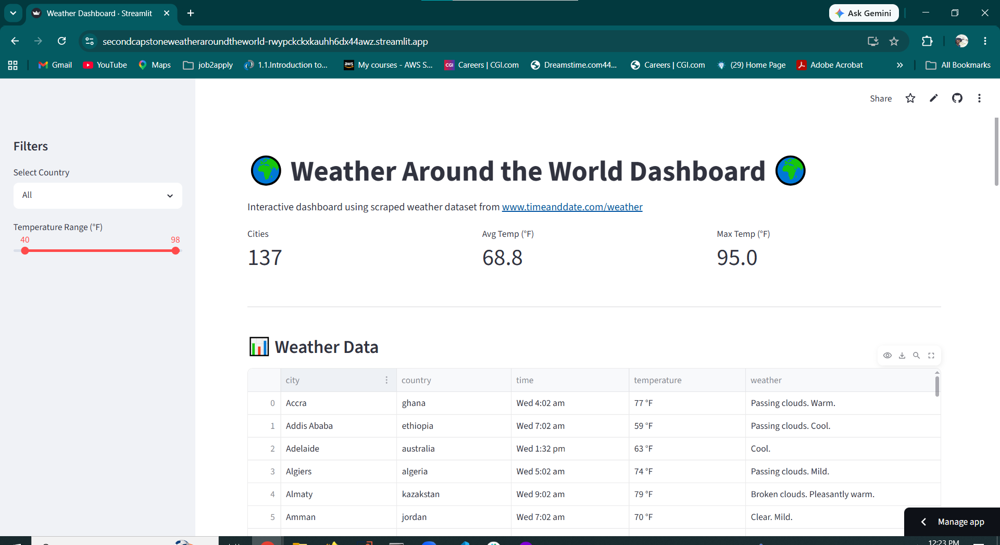

# Second_Capstone_Weather_Around_the_World
A web scraping project from www.timeanddate.com to scrap information about weather information from several cities from the world.
And a Streamlit dashboard for data visualization 

# How to run
Just make sure you have all the imports correctly
run the weather_capstone.py file

# Live App
https://secondcapstoneweatheraroundtheworld-rwypckckxkauhh6dx44awz.streamlit.app/

